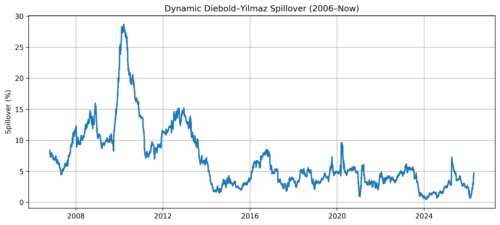
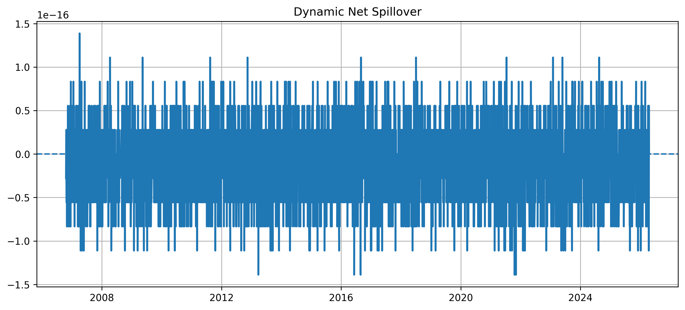
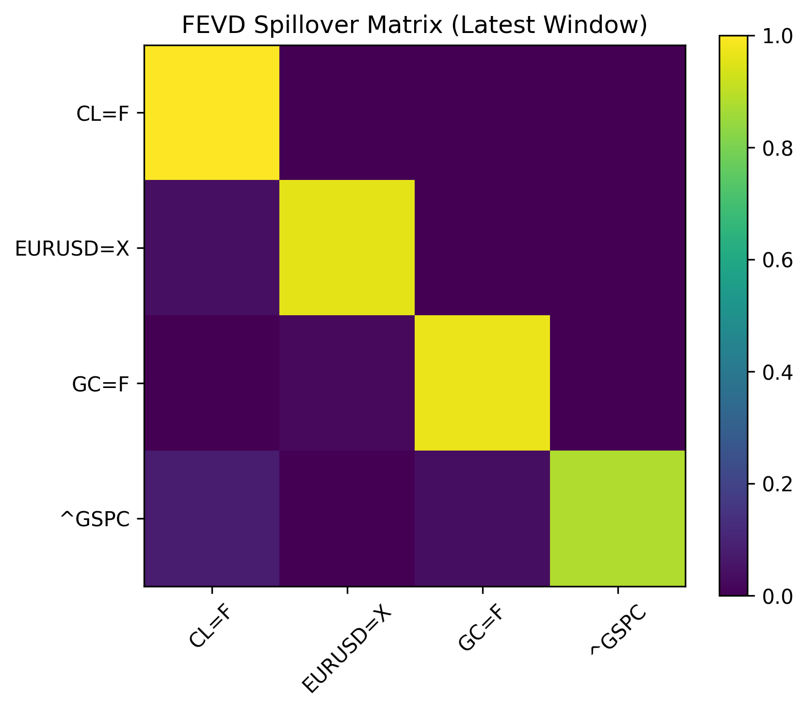

# Dynamic Diebold–Yilmaz Spillover Analysis (2006–Present)

This repository implements a dynamic spillover framework using a rolling VAR model to analyze volatility transmission across global financial markets.

## Assets
- Crude Oil (CL=F)
- Gold (GC=F)
- EUR/USD
- S&P 500

## Methodology
- Rolling VAR (200-day window)
- Cholesky decomposition
- FEVD-based spillover index
- Net directional spillover

## Output
- Dynamic spillover index
- Net spillover series
- Publication-ready figures (300 DPI)
- Summary statistics tables

  
### Figure 1: Dynamic Spillover Index


---

### Figure 2: Net Spillover Dynamics


---

### Figure 3: FEVD Spillover Matrix


## How to run

```bash
pip install -r requirements.txt
python src/main_spillover.py
python src/export_outputs.py

